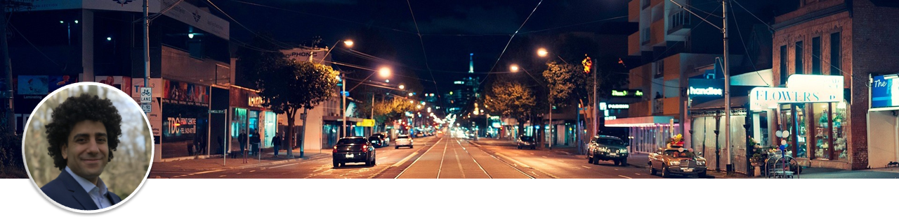

**Peter Seweiha** |
*Business Improvement Specialist*

   [LinkedIn](https://www.linkedin.com/in/pseweiha/)

   [GitHub](https://github.com/peter-seweiha)

# Machine Learning Portfolio
Repository containing portfolio of Machine Learning projects completed for academic, self learning, and professional purposes. Presented in the form of Jupyter Notebooks.

**Tools**
  - **Python**: NumPy, Pandas, Seaborn, Matplotlib
  - **Machine Learning**: scikit-learn, TensorFlow, keras

**Projects**
1. My approach to Kaggle's Titanic dataset (I made it to top 8% on Leaderboard!)  [NoteBook](https://github.com/peter-seweiha/peter-seweiha.github.io/blob/master/projects/3_The%20Titanic%20Dataset/My_solution.ipynb)

2. Natural Language Processing (NLP) - Classify restaurant reviews into positive/negative  [NoteBook](https://github.com/peter-seweiha/peter-seweiha.github.io/blob/master/projects/4_NLP/%20Natural%20Language%20Processing.ipynb)

3. Artificial Neural Networks (ANN) - Churn Prediction  [NoteBook](https://github.com/peter-seweiha/peter-seweiha.github.io/blob/master/projects/5_ANN/Churn%20Prediction%20using%20Deep%20Learning.ipynb)
